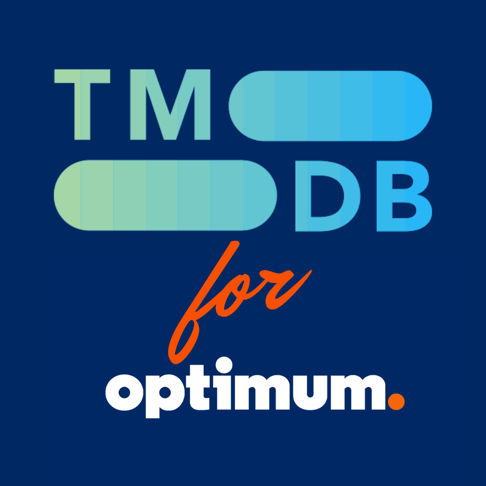
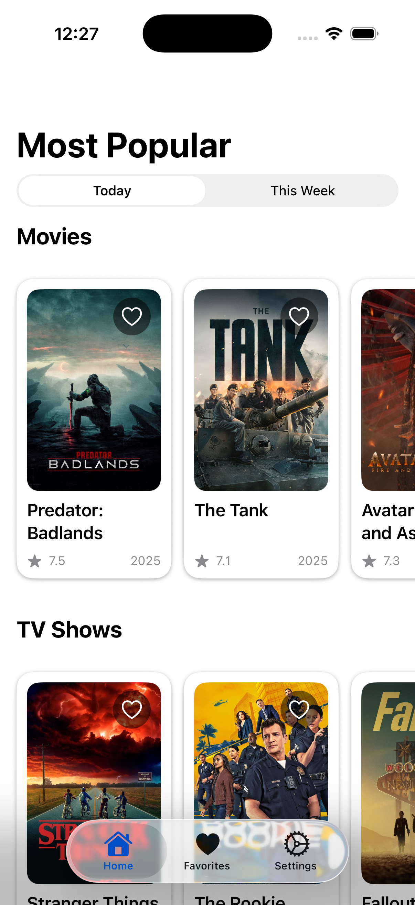
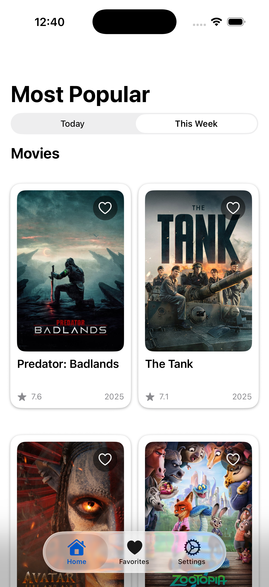
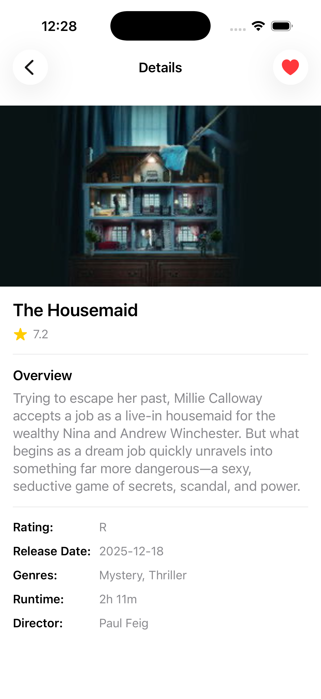
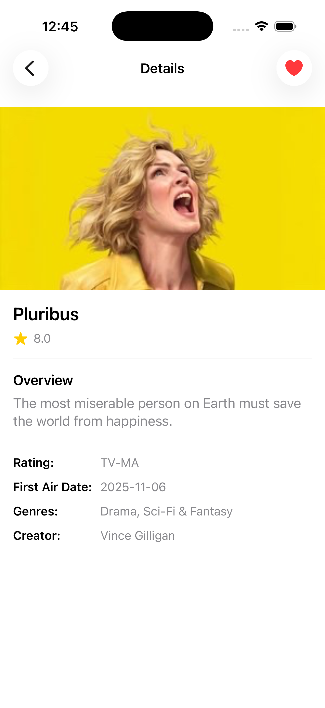
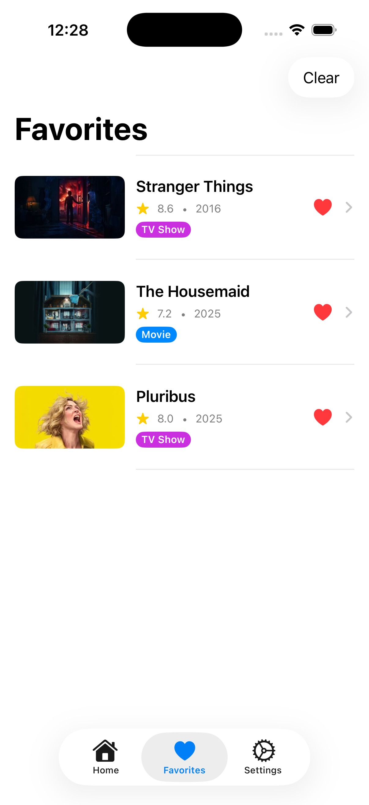
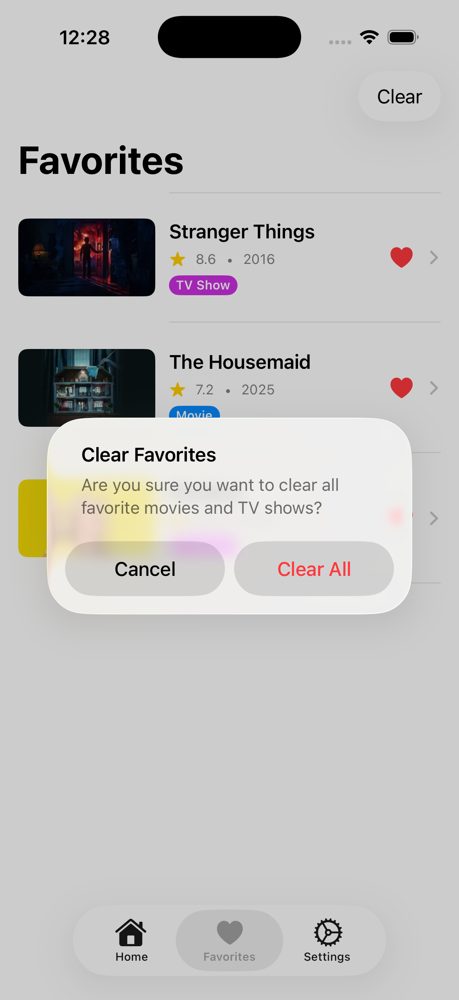
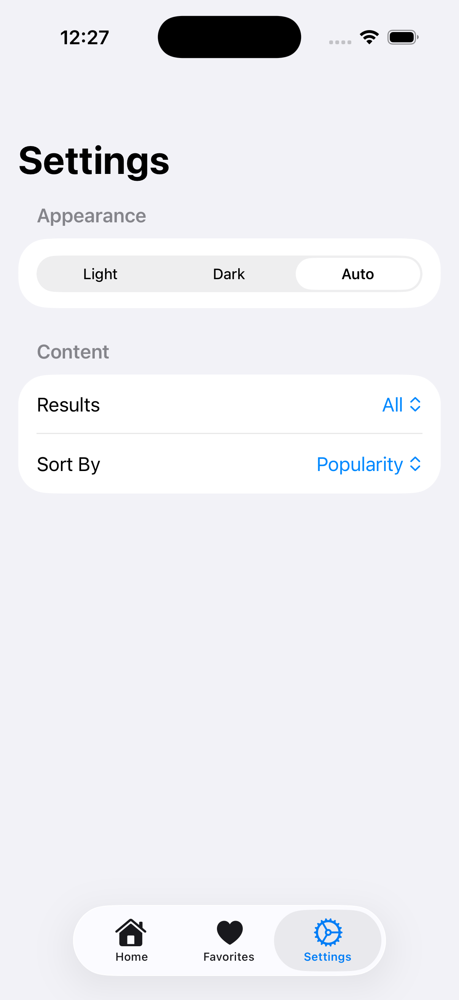

# TMDB for Optimum App

  

A simple iOS app for browsing trending movies and TV shows using The Movie Database (TMDB) API. This is prepared as part of a coding assignment, showcasing SwiftUI and following MVVM architecture.

## Assignment
Implement a movie library browser using the "TMDB API".
The app should fetch and display a list of movies and allow users to view detailed information
about each movie.

### Requirements
✅ Movie List Display

✅ Movie Details Navigation

✅ Favorite Movies

✅ Caching

✅ Error Handling

✅ Software Architecture - SOLID

✅ README.md

✅ Unit tests (optional)

### Technology Requirements
✅ Swift

✅ SwiftUI

## Requirements
  - iOS 18.2+
  - Xcode 16.0+
  - Swift 6.0+
  - TMDB API Key (free account required)

## Dependencies

  - https://github.com/Alamofire/Alamofire - Networking layer

- https://github.com/onevcat/Kingfisher - Downloading & caching web images 

## Features
- Browse trending movies and TV shows (daily/weekly)
  - View detailed information about media content including:
    - Runtime, genres, and ratings
    - Director/Creator information
    - Content certifications (PG, R, etc.)
  - Save favorites locally for quick access
  - Dark mode and light mode support
  - Clean, native iOS interface with tab-based navigation

## Approach
Since the mocks show a horizontal scroll view and a blank space below it, I saw an opportunity to incorporate the TV shows that come from the same TMDB API. Adding TV Shows along with Movies also inspired me to create a setting where a user can select which one they would like to be displayed. If the user selects only movies, or only TV shows, the home view is designed to be a vertical lazygrid to maximize the utility of the screen (and not have a blank space as in the mocks). 

I have used AlamoFire as a third party library, as it significantly cuts down on messy code that typically results from using URLRequests.
I also used the Kingfisher framework to display the poster and backdrop images, as sometimes using AsyncImage results in bugs (i.e. if the content gets reordered, the images might not load again).

Finally, I have a linter on my computer that I ran to tidy up the code by adding marks and getting rid of extra spaces.

## Installation & Setup

I put my API key in the Config.plist file. Since I'm sharing this as a zip, this file is included (otherwise it would be in the .gitignore for safety). Feel free to run it using my key for testing. You may open up the project in Xcode and run it in your simulator or device.

## Usage Example

1. On launch, you will be taken to the Home tab to browse the most popular movies from today.
2. You may tap to the "This Week" tab to see the most popular movies from this week instead.  
3. Browse the movies and TV shows by tapping on its card and see a detailed view.
4. You may tap on the heart icon at the top right of each movie or TV show card to add them to your favorites. Similarly, tapping again on a favorited movie or TV show would remove it from favorites.
5. Display your favorites in the Favorites tab. Tap on the heart to remove a single row, or tap Clear in the tab bar to remove all favorites.
6. Change your settings for the appearance (light, dark, or your iPhone's automatic setting), and the content you'd like to view (just movies, just TV shows, or all together)

## Screenshots

### Home View - All Content

### Home View - Single Category

### Details View

  
  

### Favorites

  
  

### Settings

## Architecture & Structure
The project follows the MVVM (Model-View-ViewModel) architecture:

### Models: Data structures for media content, details, genres, etc.
- MediaContent.swift
- MediaContentDetails.swift
- TrendingPeriod.swift
### SwiftUI Views: SwiftUI views and UI components
- HomeView.swift
- FavoritesView.swift
- MediaDetailsView.swift
- SettingsView.swift
- CardView.swift
- FavoriteContentRow.swift
### ViewModels: Networking, settings, and business logic
- NetworkManager.swift (manages fetching and caching from the API)
- Endpoint.swift (unifies messy URL construction)
- MediaContentVM.swift (maintains the current content)
- FavoritesManager.swift (manages favorited items stored in UserDefaults)
- AppSettings.swift (manages user settings stored in UserDefaults)

## Unit Tests
Three unit tests are there to ensure the API endpoint functionality remains intact even if the codebase changes in the future:
  - **Trending Endpoint Construction** - Verifies that trending endpoints are built with correct media type and time period
  - **Detail Endpoint Parameters** - Ensures movie/TV detail endpoints include required `append_to_response` parameters (credits, release_dates)
  - **Image URL Generation** - Validates TMDB image URLs are constructed with proper base URL and size parameters

## API Integration
  This app uses https://developer.themoviedb.org/docs to fetch:
  - Trending movies and TV shows
  - Detailed media information
  - Genres and certifications
  - Credits (directors, creators)

## Credits
- Created by Deniz Sarac for a coding assignment for Optimum.
- App icon is also created by Deniz Sarac using Canva.